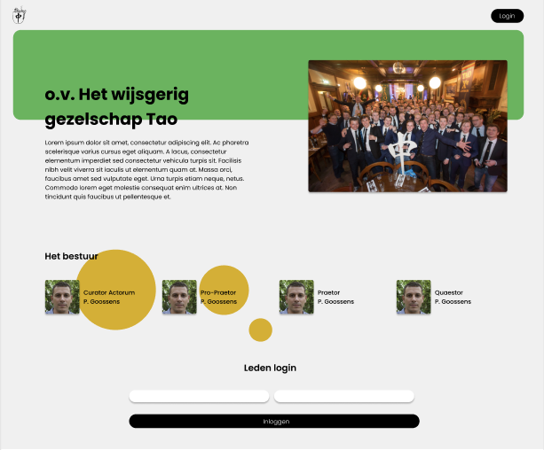
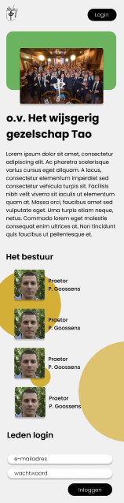
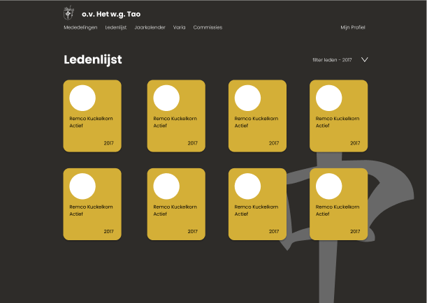
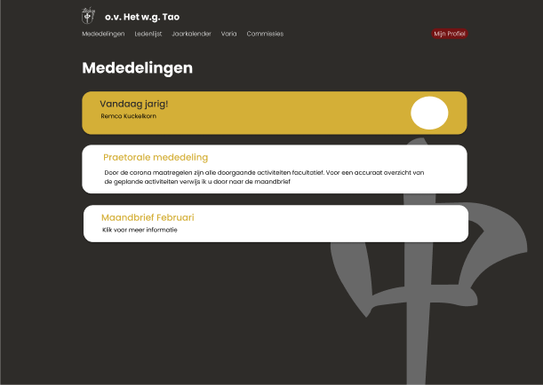
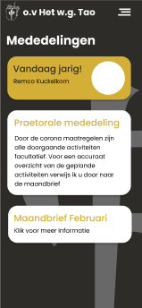

# Het w.g. Tao

## Summary

### What is it?

hetwgtao is a community site made for a studentassociation in Amsterdam affiliated with the larger association L.A.N.X.
This site has the ability to provide their members with the information provided by their board.

Like for example:

- Having a complete overview of all the present and past members and their profile

- Seeing an update of your balance (in development)

- Look at the the persons responsible for a committee (in development)

- Look at all the fun varia a person said (in development)

- Look at all the upcoming activitities (in developement)

- Have a dynamic homepage that displays the current board of the association

Most of these options are only available to the board in order to prevent mis-use of the application.
Because the association has a closed membership it is not possible to register for obvious reasons.

### The looks

Below there are some concepts I made in Figma.

#### Homepage

 

#### Memberslist

 

#### Announcements

 

Ofcourse the app doesnt't fully look like this just yet. But these images are just to give an impression of the final look. (sort of)

## Running the app

### Installation

#### 1. Clone the repository

The repository can be cloned by running `git clone` in the command line.

```zsh
git clone https://github.com/Kuckelkorn/hetwgtao
```

#### 2. Install the packages

Install the dependencies with npm.

```node
npm install
```

#### 3. Setting up your .env file

##### 1. Setup your database connection

In order to setup your database connection first you need to make a `.env` file
in that file you paste the following code if you're using mongodb paste
your info instead of the standard `<username>` , `<password>`, `<dbname>` it looks like this.

```sh
MONGODB_URI= mongodb+srv://<username>:<password>@cluster0-ea6cu.azure.mongodb.net/<dbname>?retryWrites=true
```

If you're using a different service or provider look at their documentation about setting up the connection to your database and paste it behind `MONGO_DB=`

##### 2. Setup express sessions

In order to make sessions work you have to put in the .env file a string consisting of random characters to make it really hard for hackers to guess your secret and accesing your cookies and retrieve potentially sensitive information about your users

```sh
SESSION_SECRET= 'your string'
```

### Running and viewing the application

Start the server with `npm run ndmStart`, you can view it by going to `localhost:5555` or a different specified port in your .env file

```node
1. npm run ndmStart
2. open your browser of choice and go to localhost:5555
```
